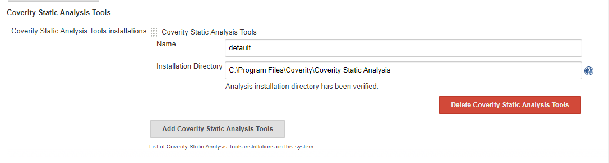
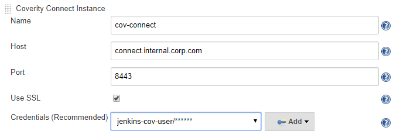
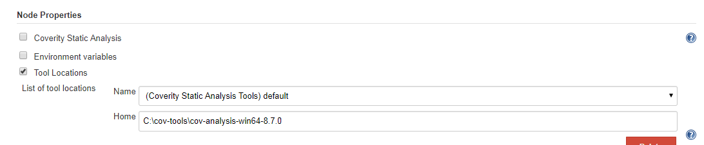
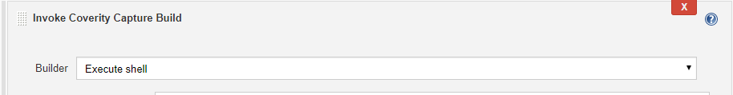
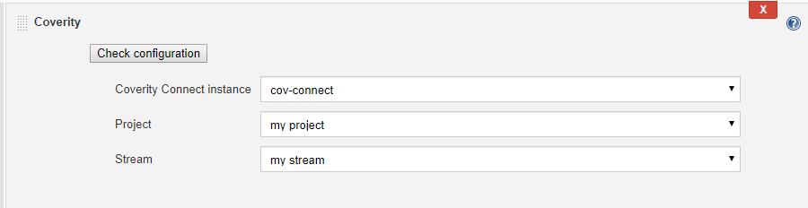
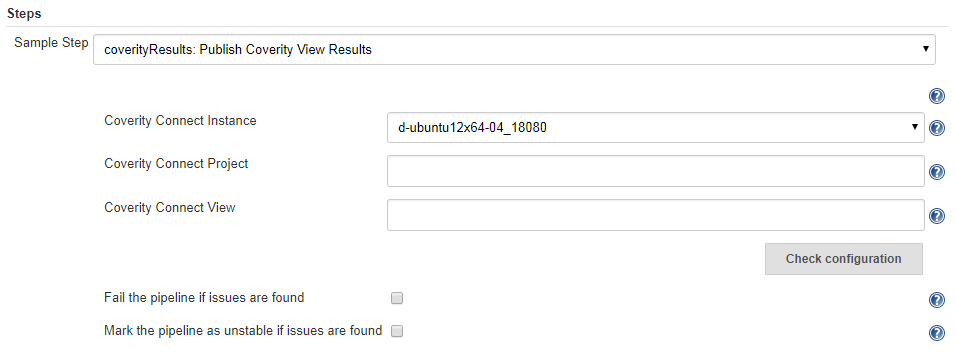

# Coverity Jenkins Plugin

*   [Overview](#overview)
*   [Compatibility](#compatibility)
*   [Features](#features)
*   [How to Use](#how-to-use)
    *   [Getting Started](#getting-started)
    *   [Freestyle Job Setup](#freestyle-job-setup)
    *   [Build Results](#build-results)
    *   [Project Configuration Settings](#project-configuration-settings)
        *   [Coverity Build Action Settings](#coverity-build-action-settings)
        *   [Coverity Post-build Action Settings](#coverity-post-build-action-settings)
    *   [Pipeline Setup](#pipeline-setup)
        *   [Using Coverity Static Analysis Tools](#using-coverity-static-analysis-tools)
        *   [Publishing Coverity results](#publishing-coverity-results)
        *   [Example Script](#example-script)
*   [Troubleshooting](#troubleshooting)
*   [Known Issues](#known-issues)
    *   [Compatibility with other Jenkins plugins](#compatibility-with-other-jenkins-plugins)
*   [Upgrade Notes](#upgrade-notes)
*   [Support](#support)
*   [Changelog](#changelog)


## Overview

This plugin integrates Coverity Connect and Analysis with the Jenkins Continuous Integration Server. ([Synopsys Static Analysis Tool (Coverity)](https://www.synopsys.com/software-integrity/resources/datasheets/coverity.html))

See [https://wiki.jenkins-ci.org/display/JENKINS/Coverity+Plugin](https://wiki.jenkins-ci.org/display/JENKINS/Coverity+Plugin) for more Jenkins Plugin specific information.


## Compatibility

The following is the plugin version compatability with Coverity Connect server and Coverity Static Analysis Tools.

Plugin version | Coverity Connect / Static Analysis version
--- | ---
**1.7.0** to **1.8.1** | **7.5.1** to **8.7.0**
**1.9.0** to **1.9.1** | **7.7.0** to **8.7.1**
**1.9.2** | **7.7.0** to **2017.07+**
**1.10.0+** | **8.0.0** to **2017.07+**

## Features

The Coverity plugin for Jenkins performs four functions:

*   It can transparently invoke the Coverity Static Analysis tools during your build (optional)
*   It can transparently invoke the Coverity Test Advisor tools during your build (optional)
*   It can fail the build if defects are found matching certain criteria
*   It reports found defects after the build

## How to Use

### Getting Started

1. Install the plugin using the **Plugin Manager**, and restart Jenkins.
1. Configure Coverity tools (**Manage Jenkins** > **Global Tool Configuration**)
   * Add Coverity Static Analysis Tools:
   
     * Add one or more tools, configuring tools for multiple platforms can be managed here. The tools named 'default' will take priority, otherwise the tools path can be configured (or overwritten) per node and/or job configuration.
     * Note: In Jenkins prior to Jenkins 2, global tools are in **Configure System**
1. Configure Coverity global settins (**Manage Jenkins** > **Configure System**)
    * Add connection details for the Coverity Connect instance
    
      * Add Credential to store Coverity Connect username and password (managed through [Credentials Plugin](https://wiki.jenkins.io/display/JENKINS/Credentials+Plugin)). Coverity plugin supports only the "Username with Password" credential kind.
      * Click **Check** to validate your settings and Coverity user account permissions
1. Configure Node specific tools (if necessary)
   * If preferred, the 'default' tools path can be overridden by setting a Tools Location in the Node configuration settings
   
     * The tools used can also be configured (or overwritten) per job configuration if this works better for your distributed build architecture

### Freestyle Job Setup

1.  Create the job, by creating it from scratch or copying from an existing job.
1.  Under **Build**, select **Add build step** and select **Invoke Coverity Capture Build**, if needed.
    
    * If no Invoke Coverity Capture Build is provided, the Coverity Plugin will transparently invoke the build capture for all build steps during your build.
1.  Under **Post-build Actions**, select **Add post-build action** and select **Coverity**.
1.  Select the Coverity Connect instance, project and stream relevant for this job.
    
1.  If you want the plugin to invoke **cov-build/cov-analyze/cov-commit-defects** for you, check **Perform Coverity build, analysis and commit**. You can add additional arguments for each of these tools, and configure the intermediate directory used (all optional).
1.  If your build already invokes Coverity, leave the checkbox unchecked.
1.  If you want to fail the build when defects are found, check the corresponding checkbox. By default all defects are considered, but you can specify filters. Every filter should match for a defect to be included.
1.  If you want the plugin to invoke test and Test Advisor functions for you, check **Perform Coverity Test Advisor and Commit**. You can add additional arguments and functionality to the build by entering your source control configurations (optional).

### Build Results

After a build has completed, a link to Coverity Defects will be available on the build page.


On the project page, a graph with historical defect counts will be visible (as soon as more than one build has been performed).


### Project Configuration Settings

To access the Coverity Plugin Configuration dialog, first choose a project in your Jenkins server, and select **Configure**.
Coverity-specific settings are available under the **Build** and **Post-build Actions** sections.

#### Coverity Build Action Settings

The Coverity build action has the following options:

Option | Description
--- | ---
Builder | Select the build step which will be wrapped with **cov-build**. Note that if Coverity Capture Build step is not added, then all build steps are wrapped.

#### Coverity Post-build Action Settings

The Coverity post-build action has the following options:

Option | Description
--- | ---
Check configuration | Click to verify that the connection to a stream in Coverity Connect is configured correctly.
Coverity Connect instance | The Coverity Connect instance selection (from global configuration).
Project | The Project which contains the Stream to commit and fetch defects.
Stream | The Stream to commit and fetch defects.
Defect Filters | Select defects according to Classification, Action, Severity, Impact, Component, Checker, or Date first detected.
Perform Coverity build, analysis, and commit | When this option is selected, Jenkins will monitor the build using cov-build, run the analysis, and commit defects to Coverity Connect. Various arguments can be specified to optimize the build process.
Perform Coverity Test Advisor and Commit | Make settings for Test Advisor Configuration, and Coverage Configuration settings specific to C/C++, C#, and Java.
Source Control Configuration 'SCM' (optional) | Make settings to enable retrieval of the version history from source control.
Fail the build if matching defects are found | Fail the build if defects are found that pass all the defect filters.
Mark build as unstable if matching defects are found | Mark the build as unstable if defects are found that pass all the defect filters.
Do not fetch defects after the build | Select this if builds are slow or fetching defects is taking too many resources.
Preserve the intermediate directory after each build | Keep the intermediate directory after a build. This will only have an effect is a non-default intermediate directory is chosen.
Hide the defects chart on the project page | Hide the defects chart on the project page. This setting can speed up page loads when there are a large number of defects or builds.

<details>
  <summary><b>Coverity Advanced Parsing</b></summary>

The Coverity plugin now provides an optional Coverity parser for interpreting commands that are executed on a Jenkins instance. If **Use advanced parsing mechanism** is selected, the Coverity parser is used instead of the default Jenkins parser. Either parser interprets environmental variables entered on the command line with a Jenkins command. The following rules describe how the Coverity parser interprets environmental variables.

The value of an environmental variable is passed into an array as follows. For example, if the variable VAR has the value “Some value”:

*   If the variable is listed in the form $VAR, then it is interpreted as [Some, value].
*   Double quotes: If listed as “$VAR”, then it is interpreted as [some value].
*   String literals: If listed as ‘$VAR’, using single quotes, then it is interpreted as [$VAR].
*   As with the bash shell, single quotes escape double quotes and conversely double quotes escape single quotes. For example:

	```
	”’”a”’”   - >   [‘a’]
	’”’a’”’   - >   [“a”]
	```

*   Concatenated environment variables are also supported. For example:

	```
	If VAR1=ABC and VAR2=123
    $VAR1$VAR2   - >   [ABC123]
	```

*   Environment variables can be concatenated to a string. For example:

	```
	${VAR1}DEF -> [ABCDEF]
   	```

#### How the Coverity parser works

The Coverity parser works in two stages, interpolation and tokenization. In the interpolation stage, the values of the command line arguments (variables) are resolved. For example, if you have the following environmental variables:

```
VAR1=Hello
VAR2=$VAR3
VAR3=$VAR4
VAR4=World
VAR5="$VAR1 $VAR2"
VAR6=$VAR1 $VAR2
```

Then the variables VAR5 and VAR6 are resolved as follows:

```
VAR5  - > "Hello World"
VAR6  - > Hello World
```

In the tokenization stage, the plugin splits up the resolved values (strings) and places them into an array.  

Following the example above:

```
VAR5  - > [Hello World]
VAR6  - > [Hello, World]
```

Note that the “Hello World” string, surrounded by unescaped quotes, is placed into the array as a single value, and the quotes are removed. The unquoted Hello World string is split into two array elements. 

</details>

### Pipeline Setup

The Coverity plugin has basic support for some pipeline functionality. It provides a `withCoverityEnv` step to wrap tool invocations and a `coverityResults` step to retrieve issues from a Coverity Connect View. In order to use these steps you will be required to setup Coverity tools in global tool configuration and a Coverity Connect instance in global configuration (see [Getting Started](#getting-started) for details).

#### Using Coverity Static Analysis Tools

*  Recommended usage:
```
withCoverityEnv('default') {
  // execute any coverity commands with either `sh` or `bat` script step
  //  (all Coverity Tools in /bin available on PATH)
}
```
   *  This will use the Coverity Static Analysis Tools installation named 'default' and add '/bin' directory to PATH within the scope of this Build Wrapper.
   *  Hint: Use the Pipeline Syntax Snippet Generator for the `withCoverityEnv` to ensure you've selected a configured tool installation
*  Other usage options using the `tool` step:
   *  With a variable in the script to access coverity tools directory, example:
   ```
   def covHome = tool name: 'default', type: 'coverity'
   sh "${covHome}/bin/cov-build --dir idir <build-command>"
   // followed by other coverity commands (using "${covHome}/bin")
   ```
   *  Manually update the env.PATH in script
   ```
   env.COV_HOME = tool name: 'default', type: 'coverity'
   env.PATH="${env.COV_HOME }:${env.PATH}" // on windows node use ;
   sh "cov-build --dir idir <build-command>"
   // followed by other coverity commands (all in /bin available on PATH)
   ```
   * You may also combine `withEnv` with the `tool` step to set a Coverity tools directory to any environment variable
*  The tools directory will be resolved for the Node which executes the pipeline (see [Getting Started](#getting-started) for details on tools installations and locations per node)
*  For tools commands which require a Coverity Connect username and password it is recommended to use the `withCredentials` step and access a configured credentialId for username with password
*  Note that as with any Coverity tools execution the build/analyze/commit steps must share the same intermediate directory value (see the Coverity Analysis User and Administrator Guide for more details)

#### Publishing Coverity results

*  The plugin offers a `coverityResults` step which will retrieve issues from a configured Coverity Connect Instance, Project, and View. By adding this step the pipeline will include any found issue results in the same manner as [Build Results](#build-results) for a pipeline.
*  Example Usage:
```
coverityResults connectInstance: 'cov-connect', connectView: 'JenkinsPipelineView', projectId: 'my project'
```
*  Use the Pipeline Syntax Snippet Generator to get help choosing a Coverity Connect Instance and verifying the Project and View values

*  Advanced options are available to fail the pipeline or mark the pipeline as unstable if any issues were found in the Coverity Connect View (use `failPipeline` or `unstable`, these both default to false).
*  The View can be configured within the Coverity Connect User Interface (use the same user credentials which will connect during the pipeline run). See the Coverity Platform User and Administrator Guide for information on configuring views.
   *  The View must be configured as an "Issues: By Snapshot" View Type. This can ensure the most recently committed issues are used, by keeping the default View "Snaphost Scope" of `last()`.
   *  The view should include the columns "CID", "Checker", "File", and "Function" in order to properly record issues per pipeline run (otherwise just a count may be shown).
   *  The View Filters should be configured for the issues which the pipeline commits. An example would be filtering on "Classification" of "Unclassified"|"Pending"|"Bug" or on "Status" of "New"|"Triaged"
   *  The View Group By setting must be set to "None" as retrieving issues with a group by view is not supported.
*  Note that this pipeline step differs greatly from the freestyle job post-build step in two major ways:
   1. The results are retrieved per project, not per stream.
      * In cases where multiple pipelines (or jobs) commit to multiple streams in the same project, different Views must be configured to filter by the proper stream.
   1. The filtering is configured entirely on Coverity Connect, not in Jenkins configuration
      *  This allows for filtering on columns which were not offered in the post-build step as well as much more dynamic date filtering capabilities.

#### Example Script

*  The following script uses a Coverity Static Analysis Tools installation named `default`, a configured "Username with Password" Credential with credentialId of `jenkins-cov-user`, and a configured Coverity Connect instance named `cov-connect`. On the Coverity Connect instance there is a project named `my project`(which contains a stream named 'my stream') and an "Issues: By Snapshot" view named `my view`.
```
node {
   stage('Preparation') {
      // checkout the source code
      git `<URL to Git Repository>`
   }
   stage('Run Coverity') {
      // use a variable for the shared intermediate directory
      iDir = 'cov-idir'
      
      withCoverityEnv('default') { 
        // run cov-build capture command
        sh "cov-build --dir ${iDir} <build-command>"
      
        // run cov-analyze command
        sh "cov-analyze --dir ${iDir}"

        // access Username with Password and set to COVERITY_PASSPHRASE and COV_USER environment variables
        withCredentials([usernamePassword(credentialsId: 'jenkins-cov-user', passwordVariable: 'COVERITY_PASSPHRASE', usernameVariable: 'COV_USER')]) {
          // run cov-commit-defects command
          sh "cov-commit-defects --dir ${iDir} --host <host> --port <port> --stream 'my stream'"
        }
      }
      
      // cleanup intermediate directory after commit was made (optional space saving step)
      dir("${iDir}") {
        deleteDir()
      }
   }
   stage('Coverity Results') {
      coverityResults connectInstance: 'cov-connect', connectView: 'my view', projectId: 'my project'
   }
}
```
*  In the example the Coverity execution is kept in a single `Run Coverity` stage, in order to break out Coverity commands into separate stages a shared Intermediate Directory will be needed. It is recommended to use the External Workspace Manager plugin if this is necessary (the Intermediate Directory is usually to large for the stash/unstash steps).

## Troubleshooting

When you encounter problems while using the plugin, please provide the following information:

*   What you were doing when the problem occurred.
*   The error message
*   The Jenkins server log file (the location is dependent on the container you use)
*   The content of ‘Manage Jenkins > System Information’ (_Jenkins root_/systemInfo)
*   The configuration file for the job (_Jenkins root_/jobs/_job name_/config.xml)
*   The global configuration file for Jenkins (_Jenkins root_/config.xml)
*   In case of problems while saving the job configuration, a screenshot before submitting, and the browser you are using.

## Known Issues

To enable the Jenkins Coverity plugin to operate with a Coverity Connect instance that is configured to use SSL, do the following:

1.  Set the environmental variable CATALINA_OPTS to this value: " -Djavax.net.ssl.trustStore=$keystore -Djavax.net.ssl.trustStorePassword=changeit";
1.  Make sure that the environmental variable $keystore points to the Java keystore used by Coverity Connect.
1.  Restart the Tomcat server.

### Compatibility with other Jenkins plugins

1.  [Flexible Publisher Plugin](https://wiki.jenkins-ci.org/display/JENKINS/Flexible+Publish+Plugin) (Coverity Post-Build Actions fail to run)

## Upgrade Notes

*   When upgrading, make sure that all jobs using the Coverity plugin are finished and not running during upgrade. For best results, restart your Jenkins after upgrade.

## Support

If you have any questions or issues with the Coverity plugin, contact <coverity-support@synopsys.com>

## Changelog

#### Version 1.10.0 (September, 2017)

*   Added support for Jenkins Pipeline by adding the pipeline steps `coverityResults` and `withCoverityEnv`. (BZ 97113)
*   Coverity plugin supports the usage of Credentials Manager in the global configuration. (BZ 107429)
*   Added Coverity Static Analysis Tools as a tool installation, configured through Global Tools Configurations in Jenkins 2 and newer (also improves pipeline support).
*   Deprecating the existing Coverity tools location and the location node property, users should instead configure tools using the Global Tool Configuration. These fields will be removed in an upcoming release. (BZ 108096)
*   Added feature to override the Coverity Connect username and password for a Job using a Credentials value. (BZ 92651)
*   Added feature to override the Coverity Static Analysis Tools for a Job using a global tool installation. (BZ 107178)
*   Deprecating the existing Coverity Connect Username and Password fields, users should instead configure a Username with Password Credential (through the Credentials Plugin) to provide Coverity Connect with authentication information. These fields will be removed in an upcoming release. (BZ 108097)
*   The minimum supported version of Coverity Connect and Coverity Analysis tools is 8.0.0. (BZ 106531)
*   Fixed an issue where a blank Node property for Coverity Static Analysis Location would fail builds with the error "[Node] Jenkins : Could not Find Coverity Analysis Home Directory.". (BZ 101161)
*   Added SCM drop-down entries for Team Foundation Server 2015 & 2017, Plastic & Plastic (fully distributed). These SCMs are supported in newer Coverity tool version 2017.07 (with the exception of TFS 2015 which was supported in prior versions) (BZ 105111)
*   The Coverity plugin provides UI validation for "Post cov-build command" and "Post cov-analyze command". Also, if commands for either is not supplied, the "Post cov-build" and "Post cov-analyze" steps will be skipped with warnings on the console output. (BZ 107703)
*   The "Dataport" field in the global Coverity Connect configuration has been removed. (BZ 108016)

#### Version 1.9.2 (July 6, 2017)

*   Added compatibility for 2017.07 Coverity Connect and Analysis tools. (Note: Older Coverity plugin versions will not work with the Coverity Connect 2017.07 and newer releases) (BZ 104760)
*   Fixed an issue where special password characters caused an error establishing a connection with Coverity Connect. (BZ 104837)
*   Fixed an issue where setting extra CA certificate was using the argument --cert, instead of --certs. (BZ 104659)
*   Improved user permission checking which should reduce validation delays introduced in 1.9.1. (BZ 105657)

#### Version 1.9.1 (April 19, 2017)

*   Fixed issue where defects were not shown on the chart when the the "Fail the build if matching defects are found" option checked. (BZ 102658)
*   Resolved issue where check for "commitToStream" and "viewDefects" permissions fails if they are inherited from groups. (BZ102421)

#### Version 1.9.0 (March 17, 2017)

*   Changed **Required Core** Jenkins version from 1.534 to 1.651.3\. (BZ 101526)
*   Fixed the error "command line parsing fails" when using the MSbuild, Gradle, or NAnt plugins to build with Coverity on Windows. (BZ 101359, 101799)
*   The ability to filter on Checkers is deprecated, and this functionality will be removed in an upcoming release. (BZ 101225)
*   Resolved an issue where links to view Coverity defects were broken if any of the instance, project, or streams names had spaces. Updated the graph key display name to "Coverity Defects (stream name)" and the defects page URL to "coverity_defects". (BZ 100794)
*   The Coverity Jenkins plugin now provides a new "Invoke Coverity Capture Build" as part of build step for users to specify which build step they wish to capture build from. Other build steps will be performed normally without wrapping around with the Coverity cov-build. (BZ 52497, 88273, 93992, 98963, 100175, 100514)
*   The Coverity plugin correctly sets up the intermediate directory when capturing builds of source files that only include scripting languages. (BZ 100126)
*   The ability to specify multiple commit streams in a single Jenkins job was removed. Existing configurations with more than one commit stream will continue to use the first commit stream specified. Links to defects for additional streams on old build jobs will now only show the main stream defects. (BZ 99084)
*   The custom intermediate directory (or default intermediate directory) is deleted whether the build was successful or a failure, unless the option to preserve the intermediate directory is checked. (BZ 99064)
*   Removed support for v6 web services (Coverity Connect version 7.6.x and earlier) and older Coverity Analysis Tools (version 7.6.x and earlier). (BZ 98702)
*   The Coverity Defects page displays **CID/Checker/Function/File Location** of defects. (BZ 97772)
*   The Jenkins Coverity plugin does not work properly when it is configured inside the Flexible Publish plugin. This is not a supported way of using the Jenkins Coverity plugin. (BZ 97184)
*   Resolved an issue with the Unstable status being incorrectly set. (BZ 82665, 88020, 92293, 96455)
*   Resolved an issue with the Dismissed defects status being implicitly filtered (regardless of classification filters). (BZ 82665, 88020, 92293, 96455)
    Note: This may cause an increase in defects which were previously filtered automatically to be unfiltered (to match filtering de-select classifications "False Positive", "Intentional" "No Test Needed", "Tested Elsewhere"). (BZ 82665, 88020, 92293, 96455)
*   Updated the default classification filters selected to match Coverity Connect Outstanding view filters. (BZ 82665, 88020, 92293, 96455)
*   Removed "Microsoft Code Analysis results files" option (use "Search for Microsoft Code Analysis results" option instead). (BZ 94805)
*   The Coverity plugin no longer provides a drop-down to select the "Language" in the configuration. (BZ 92811)
*   Resolved an issue where Coverity publisher could not be configured by the Job DSL plugin. (BZ 91929)
*   The configuration checking logic was improved. (BZ 84848)
*   The "Check Configuration" button on the configuration page will validate the "Test Advisor" and "SCM" configurations as well as project and stream. (BZ 82064)
*   Removed the 3000 defect limit when downloading defects from the Coverity Connect stream. (BZ 73634)
*   Modified filtering to use built-in web service capabilities. This should reduce the total number of defects and amount of data retrieved from Coverity Connect. (BZ 73634)
*   Updated the "Coverity Defects" page (BuildAction) so it includes all defect information. This will greatly improve the response time when viewing the Coverity Defects page. (BZ 73634)
*   By clicking the "Check" button on the global configuration, the Coverity plugin will not only check the connection to the Coverity Connect instance, but will check the user's permission as well. The user is required to have "Commit to Stream", "Access web service", and "View Issues" in order to use the Coverity Jenkins plugin. (BZ 71109)
*   The Coverity plugin will not fail the build when there is no snapshot in the stream, before running cov-manage-history and continuing its post-build actions. (BZ 67320)
*   Users can now configure multiple strip paths for their Test Advisor configurations. (BZ 65793)
*   Show a "loading projects" message when the Coverity Connect instance changes in the job configuration. (BZ 60138)
*   The Coverity plugin will display the invalid project and error message to indicate that the select project cannot be found in Coverity Connect. (BZ 55377)
*   Resolved a NullPointerException on the CoverityTempDir (idir) (BZ 101589)

<details>
  <summary><b>Changelog for older versions</b></summary>
  
#### Version 1.8.1 (January 9, 2017)

*   Support for Coverity Connect v6 web services is deprecated, and in a future release support for Coverity Analysis and Coverity Connect versions 7.6.x and earlier will be removed. (BZ 98801)
*   Resolved an issue where the Coverity plugin could cause the build job results page to take a long time to load. (BZ 95459)
*   Resolved an issue with environment variables that caused the plugin to fail on Windows (This issue was introduced in 1.8.0). (BZ 94839)

#### Version 1.8.0 (September 23, 2016)

*   Added support for 'Additional SCM arguments' on Coverity version 7.0.x. (BZ 94678)
*   Added new Coverity parser for interpreting environmental variables. (BZ 94604)
*   Resolved issue with a master/slave setup, where the intermediate directory was preserved when it should have been deleted. (BZ 94550)
*   Resolved an issue with a plugin crash occurring when setting 'cov-build blacklist' and 'display chart' to true. (BZ 94413)
*   Added support for --filename-regex option in Coverity 7.0.x. (BZ 94036)
*   Resolved an issue with parsing environmental variables by using the Coverity parser." (BZ 94034)
*   Resolved an issue with incorrectly wrapping argument to --misra-config. (BZ 94031)
*   Added messages for when attempting to build with an incorrect or partially configured Coverity Connect information. (BZ 93458)
*   Resolved issues with environmental variables not being resolved correctly. (BZ 93390)
*   Resolved issues with parsing environmental variables. (BZ 93380)
*   Displays error message when stream or language settings are left blank. (BZ 93288)
*   Fixed an issue with incorrect parsing of environment variable values containing spaces. (BZ 93136)
*   Resolved an issue where the -ssl option was used with incompatible Coverity versions. (BZ 92290)
*   If a change in source code doesn't result in a new build, cov-analyze fails. Workaround is to add a dummy file which always gets built. (BZ 89440)
*   Resolved an issue so that an error message is displayed when Stream is left blank in configuration. (BZ 89238)
*   Resolved an issue with running cov-commit-defects command with --on-new-cert trust set. (BZ 88959)
*   Resolved an issue that caused builds to fail when a WAR file is specified. (BZ 88086)
*   Resolved an issue where path names containing spaces were split. (BZ 87862)
*   Provided support for using scripting languages only, compiled languages only, or both scripting and compiled language sources. (BZ 87531)
*   Resolved an issue where arguments were not properly wrapped in quotes. (BZ 87051)
*   Resolved an issue where defects were not fetched from Coverity Connect and displayed on a graph in Jenkins after upgrading the plugin. (BZ 86997)
*   Resolved an issue with the --misra-config option. (BZ 86622)
*   Resolved an issue that caused plugin to fail when stream name contains spaces. (BZ 85945)
*   Resolved issue that prevented MISRA checkers being enabled. (BZ 85858)
*   Added environmental variables to enable running cov-import with a script after cov-build and cov-analyze commands. (BZ 84077)
*   Resolved an issue with using environmental variables in the intermediate directory setting. (BZ 82984)
*   Resolved a problem to support having spaces in the Coverity Static Analysis Location. (BZ 81464)
*   Resolved an issue with cov-analyze failing when the options list included two or more embedded spaces. (BZ 75510)
*   Resolved issue with a null pointer exception occurring when clicking Defect Filters. (BZ 71782)
*   Resolved an issue with null pointer exception when filtering by impact. (BZ 71499)
*   Resolved an issue to warn the user of a delay when changing a project in Coverity Connect. (BZ 69229)
*   Added a method to allow users to execute commands after cov-build and cov-analyze commands. (BZ 66147)
*   Resolved an issue so that the job configuration page loads normally even if the Coverity Connect configuration is invalid. (BZ 59241)
*   Resolved issue where removing a user's web access permission caused a crash. Now reports a message concerning insufficient user permissions. (BZ 46833)
*   Resolves a problem by issuing an error message when a stream is deleted from a job configuration. (BZ 35447)

#### Version 1.7.3 (August 5, 2016)

*   Resolved issue that prevented analysis of multiple .WAR files. (BZ 66004)

#### Version 1.7.2 (August 3, 2016)

*   Skipped due to logistics issue.

#### Version 1.7.1 (February 8, 2016)

*   Resolved issue that caused the plugin to fail to analyze after cov-build executes. This issue only occurred when using Coverity Analysis 8.0.0 (BZ 85629)

#### Version 1.7.0 (February 4, 2016)

*   Resolved issue of defects not being counted when local was set to Japanese. (BZ 79147)
*   The deprecated cov-analyze[-java] has changed to cov-analyze. (BZ 83277)
*   The option --misra-only will not be used on Jasper and later releases. (BZ 83372)
*   Resolved issue of chart not drawing job numbers correctly. Adding the "Display defects on chat option in order to address this issue. (BZ 85014)
*   Resolved issue of finding analysis home directory on slave machines. (BZ 81254)

#### Version 1.6.0 (October 9, 2015)

*   Resolved incompatibility between --misra-only and Test Advisor. (BZ 78807)
*   Added the capability for adding many war files. (BZ 66004)
*   Resolved issues when using an intermediate directory. (BZ 79060)
*   Added a field for --filename-regex option. Also, added a field for additional commands for the scm option. (BZ 79395)
*   Added a check button for the analysis installation directory. When the user clicks on it the plugin verifies that the given directory exists. In case the user doesn't verify this, additional checking mechanisms were added during the build to prevent misleading exception messages. (BZ 79525)

#### Version 1.5.2 (July 9, 2015)

*   Added MISRA support. In order to perform analysis and commit when using MISRA, there is a new option for called "<span>Use MISRA for analysis and commit" that once selected will display a text box where a configuration file should be specified.</span>
*   <span>Fix issue with "--include-java"  option being added by default.</span> 
*   Fix error message when checking configurations.

#### Version 1.5.1 (June 23, 2015)

*   Removed "Advanced Options" from the Configure System page.
*   When using 7.7.0.
    *   Drop-down menu for languages only allows “ALL”.
    *   Under “Defect filters” for each job configuration, the “show checkers” option displays all checkers for the Coverity Connect instance associated with that job. 
*   Added support for Coverity Web Services v9.

#### Version 1.5.0 (January 30, 2015)

*   User input in configuration now resolves environment variables
*   Added new checkers to the defect list for each language. List has been updated to all checkers present to 7.6.0 
*   <details>
      <summary>New C/C++ Checkers</summary>

	```
    ASSIGN_NOT_RETURNING_STAR_THIS
    ATOMICITY
    BAD_EQ
    BAD_EQ_TYPES
    BAD_LOCK_OBJECT
    BAD_OVERRIDE
    BAD_SHIFT
    BUFFER_SIZE
    CALL_SUPER
    CHROOT
    COM.ADDROF_LEAK
    COM.BAD_FREE
    COM.BSTR.ALLOC
    COM.BSTR.BAD_COMPARE
    COM.BSTR.CONV
    COM.BSTR.NE_NON_BSTR
    CONFIG.STRUTS2_ENABLED_DEV_MODE
    COPY_PASTE_ERROR
    COPY_WITHOUT_ASSIGN
    CTOR_DTOR_LEAK
    DC.STREAM_BUFFER
    DC.STRING_BUFFER
    DC.WEAK_CRYPTO
    DELETE_ARRAY
    DELETE_VOID
    GUARDED_BY_VIOLATION
    HFA
    IDENTICAL_BRANCHES
    INTEGER_OVERFLOW
    INVALIDATE_ITERATOR
    LOCK
    LOCK_EVASION
    LOCK_INVERSION
    MISMATCHED_ITERATOR
    MISSING_ASSIGN
    MISSING_COMMA
    MISSING_COPY
    MISSING_COPY_OR_ASSIGN
    MISSING_LOCK
    MISSING_RESTORE
    MISSING_THROW
    NON_STATIC_GUARDING_STATIC
    OPEN_ARGS
    ORDER_REVERSAL
    OVERRUN_STATIC
    PARSE_ERROR
    PASS_BY_VALUE
    PW.INCLUDE_RECURSION
    READLINK
    RISKY_CRYPTO
    RW.ROUTINE_NOT_EMITTED
    SECURE_CODING
    SECURE_TEMP
    SELF_ASSIGN
    SLEEP
    SW.INCOMPLETE_TYPE_NOT_ALLOWED
    SWAPPED_ARGUMENTS
    SYMBIAN.CLEANUP_STACK
    SYMBIAN.NAMING
    UNCAUGHT_EXCEPT
    UNINIT
    UNINIT_CTOR
    UNINTENDED_INTEGER_DIVISION
    UNREACHABLE
    UNUSED_VALUE
    USELESS_CALL
    USE_AFTER_FREE
    VARARGS
    VIRTUAL_DTOR
    VOLATILE_ATOMICITY
    WRAPPER_ESCAPE
	```
    </details>
*   <details>
      <summary>New Java Checkers</summary>

	```
    ATOMICITY
    BAD_CHECK_OF_WAIT_COND
    BAD_LOCK_OBJECT
    BAD_SHIFT
    CONFIG.DUPLICATE_SERVLET_DEFINITION
    CONFIG.DWR_DEBUG_MODE
    CONFIG.DYNAMIC_DATA_HTML_COMMENT
    CONFIG.HTTP_VERB_TAMPERING
    CONFIG.JAVAEE_MISSING_HTTPONLY
    CONFIG.MISSING_GLOBAL_EXCEPTION_HANDLER
    CONFIG.MISSING_JSF2_SECURITY_CONSTRAINT
    CONFIG.SPRING_SECURITY_DEBUG_MODE
    CONFIG.SPRING_SECURITY_DISABLE_AUTH_TAGS
    CONFIG.SPRING_SECURITY_HARDCODED_CREDENTIALS
    CONFIG.SPRING_SECURITY_REMEMBER_ME_HARDCODED_KEY
    CONFIG.SPRING_SECURITY_SESSION_FIXATION
    CONFIG.STRUTS2_CONFIG_BROWSER_PLUGIN
    CONFIG.STRUTS2_DYNAMIC_METHOD_INVOCATION
    CONFIG.STRUTS2_ENABLED_DEV_MODE
    CONSTANT_EXPRESSION_RESULT
    COPY_PASTE_ERROR
    CSRF
    DC.CODING_STYLE
    DC.DANGEROUS
    DC.DEADLOCK
    DC.EXPLICIT_DEPRECATION
    DC.GC
    DC.JRE14COMPATIBLE
    DC.JRE15COMPATIBLE
    DC.LOCALIZATION
    DC.PERFORMANCE
    DC.THREADING
    DEADCODE
    DIVIDE_BY_ZERO
    DOUBLE_CHECK_LOCK
    EL_INJECTION
    GUARDED_BY_VIOLATION
    HARDCODED_CREDENTIALS
    HEADER_INJECTION
    HIBERNATE_BAD_HASHCODE
    IDENTICAL_BRANCHES
    INDIRECT_GUARDED_BY_VIOLATION
    INFINITE_LOOP
    JAVA_CODE_INJECTION
    JCR_INJECTION
    JSP_DYNAMIC_INCLUDE
    JSP_SQL_INJECTION
    LDAP_INJECTION
    LOCK_EVASION
    LOCK_INVERSION
    LOCK_ORDERING
    MISSING_BREAK
    MISSING_RESTORE
    MISSING_THROW
    MIXED_ENUMS
    NESTING_INDENT_MISMATCH
    NON_STATIC_GUARDING_STATIC
    NOSQL_QUERY_INJECTION
    OGNL_INJECTION
    ORM_LOAD_NULL_CHECK
    ORM_LOST_UPDATE
    ORM_UNNECESSARY_GET
    OS_CMD_INJECTION
    OVERFLOW_BEFORE_WIDEN
    PATH_MANIPULATION
    REGEX_CONFUSION
    REGEX_INJECTION
    RISKY_CRYPTO
    SCRIPT_CODE_INJECTION
    SENSITIVE_DATA_LEAK
    SERVLET_ATOMICITY
    SESSION_FIXATION
    SINGLETON_RACE
    SQLI
    STRAY_SEMICOLON
    SWAPPED_ARGUMENTS
    TAINT_ASSERT
    UNEXPECTED_SYNC
    UNINTENDED_INTEGER_DIVISION
    UNKNOWN_LANGUAGE_INJECTION
    UNREACHABLE
    UNRESTRICTED_DISPATCH
    UNSAFE_DESERIALIZATION
    UNSAFE_JNI
    UNSAFE_LAZY_INIT
    UNSAFE_REFLECTION
    UNUSED_VALUE
    USELESS_CALL
    WEAK_PASSWORD_HASH
    WRONG_METHOD
    XPATH_INJECTION
    XSS
	```
    </details>
*   <details>
      <summary>New C# Checker</summary>

	```
    ALLOC_FREE_MISMATCH
    ARRAY_VS_SINGLETON
    ASSERT_SIDE_EFFECT
    ASSIGN_NOT_RETURNING_STAR_THIS
    BAD_ALLOC_ARITHMETIC
    BAD_ALLOC_STRLEN
    BAD_COMPARE
    BAD_FREE
    BAD_LOCK_OBJECT
    BAD_OVERRIDE
    BAD_SHIFT
    BAD_SIZEOF
    BUFFER_SIZE
    CALL_SUPER
    CHAR_IO
    CHECKED_RETURN
    CHROOT
    COM.ADDROF_LEAK
    COM.BAD_FREE
    COM.BSTR.ALLOC
    COM.BSTR.BAD_COMPARE
    COM.BSTR.CONV
    COM.BSTR.NE_NON_BSTR
    CONSTANT_EXPRESSION_RESULT
    COPY_PASTE_ERROR
    COPY_WITHOUT_ASSIGN
    CTOR_DTOR_LEAK
    DC.STREAM_BUFFER
    DC.STRING_BUFFER
    DC.WEAK_CRYPTO
    DEADCODE
    DELETE_ARRAY
    DELETE_VOID
    DIVIDE_BY_ZERO
    ENUM_AS_BOOLEAN
    EVALUATION_ORDER
    FORWARD_CLASSCAST
    FORWARD_NULL
    IDENTICAL_BRANCHES
    INCOMPATIBLE_CAST
    INFINITE_LOOP
    INTEGER_OVERFLOW
    INVALIDATE_ITERATOR
    LOCK
    LOCK_EVASION
    MISMATCHED_ITERATOR
    MISRA_CAST
    MISSING_BREAK
    MISSING_COMMA
    MISSING_COPY_OR_ASSIGN
    MISSING_LOCK
    MISSING_RESTORE
    MISSING_RETURN
    MISSING_THROW
    MIXED_ENUMS
    NEGATIVE_RETURNS
    NESTING_INDENT_MISMATCH
    NO_EFFECT
    NULL_RETURNS
    OPEN_ARGS
    ORDER_REVERSAL
    OVERFLOW_BEFORE_WIDEN
    OVERRUN
    OVERRUN_DYNAMIC
    OVERRUN_STATIC
    PARSE_ERROR
    PASS_BY_VALUE
    READLINK
    RESOURCE_LEAK
    RETURN_LOCAL
    REVERSE_INULL
    REVERSE_NEGATIVE
    RISKY_CRYPTO
    SECURE_CODING
    SECURE_TEMP
    SELF_ASSIGN
    SIGN_EXTENSION
    SIZECHECK
    SIZEOF_MISMATCH
    SLEEP
    STACK_USE
    STRAY_SEMICOLON
    STREAM_FORMAT_STATE
    STRING_NULL
    STRING_OVERFLOW
    STRING_SIZE
    SWAPPED_ARGUMENTS
    SYMBIAN.CLEANUP_STACK
    SYMBIAN.NAMING
    TAINTED_SCALAR
    TAINTED_STRING
    TOCTOU
    UNCAUGHT_EXCEPT
    UNINIT
    UNINIT_CTOR
    UNINTENDED_INTEGER_DIVISION
    UNREACHABLE
    UNUSED_VALUE
    USELESS_CALL
    USER_POINTER
    USE_AFTER_FREE
    VARARGS
    VIRTUAL_DTOR
    VOLATILE_ATOMICITY
    WRAPPER_ESCAPE
	```
    </details>

*   Fixed SSL issue with cov-manage-history  
*   Fixed issue where cov-build was run when "Perform Coverity build, analysis and commit" was not selected
*   Fixed graphs breaking when a build has more than one CIM instances.
*   Added Impact into defect filters. Checkers can now be filtered by impact**

	**_(Note)_** After upgrade, the build configuration might need to be reconfigured so that impact filtering can be added. Initial build after upgrade might return zero defects.

*   Builds can now be marked as 'Unstable' if defects are found
*   Fixed issue where defect totals was being printed as total defects instead of matched defects

#### Version 1.4.1 (July 25, 2014)

*   Fixed issues with receiving ERROR text within Defect Filters
*   Fixed issue where checking configuration in Views gave back an ERROR text
*   Commit to SSL now works properly 
*   Plugin now connects correctly with Coverity Connect 6.5.0

#### Version 1.4.0 (June 30, 2014)

*   Added Coverity Test Advisor tools to be ran during build
*   Added cov-history command and source control functionality to Coverity Test Advisor tools. 

#### Version 1.3.1 (March 31, 2014)

*   Changed method for determining Static Analysis version (BZ 61464)
*   Allowed Coverity Plugin to accept similar version of Coverity Connect and Analysis , but different patches  (BZ 62013)
*   Increased maximum number of defects shown in job page to 3000 (BZ 60322)
*   Allowed older versions of Static Analysis work with new versions of Coverity Connect (BZ 62196)

#### Version 1.3.0 (December 19, 2013)

*   Improve documentation
*   Increase maximum number of defects shown in job page to 1000 (BZ 55368)
*   Add support for 'Mixed Domain' (any language) streams (BZ 57461)
*   Add support for Coverity Analysis 7.0.0 (BZ 55618)
*   Don't fail the build if analysis and defect checking are both disabled (BZ 49096)

#### Version 1.2.7 (August 12, 2013)

*   Improve compatibility with older versions of Connect/CIM. (BZ 54854)

#### Version 1.2.6 (July 24, 2013)

*   Allow overrides for analysis/commit settings for an individual job (BZ 47499, BZ 45728)
*   Add support for cov-emit-java --webapp-archive
*   Add support for FxCop/MSVSCA results (BZ 50247)
*   Add automatic searching for C# assemblies
*   Fix a bug where builds would hang when JDKs were automatically installed (BZ 50669)
*   Fix a bug that caused linux/solaris executables to called as if they were on windows (BZ 55117)
*   Improve error message when a configured stream is absent in CIM/Connect (BZ 54068, BZ 51304)

#### Version 1.2.5 (June 28, 2013)

*   Upgrade Coverity web services code to v5\. (BZ 51322)

#### Version 1.2.4 (May 20, 2013)

*   Redo the previous fix from 1.2.3, as it broke some workflows. (BZ 52107)

#### Version 1.2.3 (May 10, 2013)

*   Fix a NullPointerException that occurred when the build/analyze/commit checkbox was unchecked. (BZ 52034)

#### Version 1.2.2 (April 29, 2013)

*   Add an option for specifying the commit port of a CIM instance manually, as a workaround for an issue with committing defects. (BZ 51458)

#### Version 1.2.1 (April 29, 2013)

*   Fix a NullPointerException during C# builds. (BZ 50321)

#### Version 1.2.0 (March 25, 2013)

*   Allow configuration of multiple streams and languages for each job. The appropriate analysis and commit steps will be run for each. (BZ 47499)

#### Version 1.1.5 (February 4, 2013)

*   Fix a bug where normally hidden streams would be available for selection in configuration (BZ 49226)
*   Add a field for blacklisting executables from being wrapped by cov-build (BZ 38025, BZ 47534, BZ 48921, JIRA JENKINS-14834)
*   Add an option to hide the defects chart (BZ 47524)
*   Update checkers list to match 6.5.0 checker documentation (BZ 48917)

#### Version 1.1.4 (January 14, 2013)

*   Add an option to not fetch defects after commit (BZ 47226)
*   Allow static analysis binaries to be specified on a per-job basis (BZ 47224)
</details>
